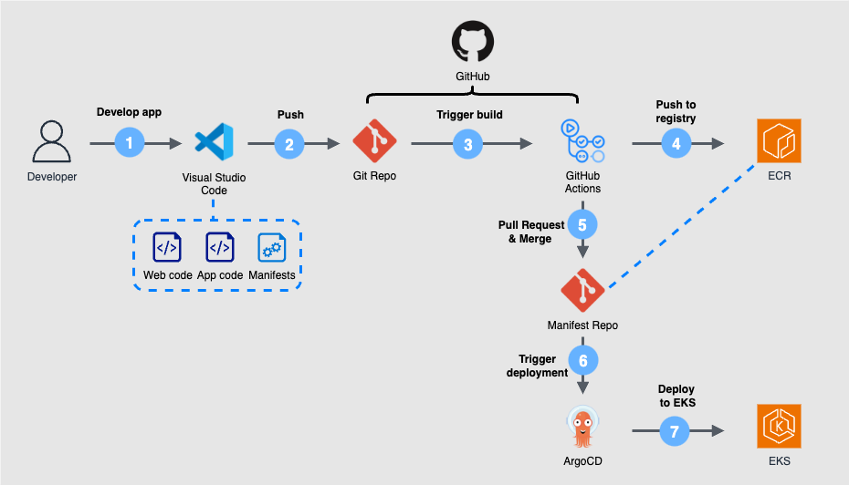

# ☸️ Petclinic Kubernetes Manifests

This repository contains the Kubernetes manifests and GitOps configurations for deploying the Petclinic application on AWS EKS using Argo CD.  
The system follows a 3-Tier architecture and leverages GitHub Actions and Pull Request approvals for safe, automated deployments.

---

## 🏗️ Architecture


---

## 🧱 Architecture Overview

```
[ Web Tier ]  → Apache HTTPD (reverse proxy) - petclinic-web
[ App Tier ]  → Spring Boot application - petclinic-app
[ DB Tier  ]  → AWS RDS (MySQL)
```

---

## 📂 Repository Structure

```
.
├── base/
│   ├── ingress.yaml           # Ingress routing rules
│   ├── kustomization.yaml     # Kustomize config for base
│   ├── was-deploy.yaml        # WAS (Spring Boot App) deployment
│   ├── was-svc.yaml           # WAS Service
│   ├── web-deploy.yaml        # Web (HTTPD) deployment
│   └── web-svc.yaml           # Web Service
```

---

## 🔁 GitOps Workflow

1. A Docker image is built in the [`petclinic-app`](https://github.com/sophie-in-the-cloud/petclinic-app) repository and pushed to AWS ECR
2. GitHub Actions automatically creates a Pull Request to this repository with the updated image tag
3. Once the PR is **reviewed and approved**, Argo CD detects the change and syncs the deployment to EKS

> This process enforces auditable and controlled production deployments

---

## 📂 Ingress

Ingress is defined in `base/ingress.yaml` and routes traffic from a domain (e.g. `sophiel.shop`) to the Web Tier.  
The Web Tier then reverse proxies to the Application Tier.

---

## 🛡️ Security

- No secrets are stored in this repository  
- Database credentials and other secrets are managed securely via **AWS Secrets Manager**, injected into containers at runtime

---

## 📊 Monitoring

- Monitoring can be configured using Prometheus, Grafana, or Whatap  
- Alerts and metrics collection can be integrated with Slack or email as needed
